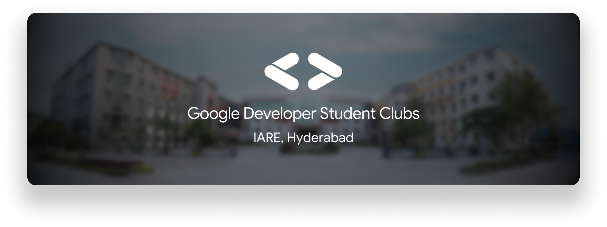
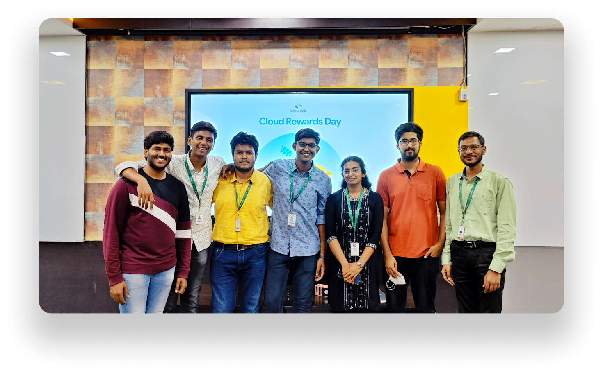
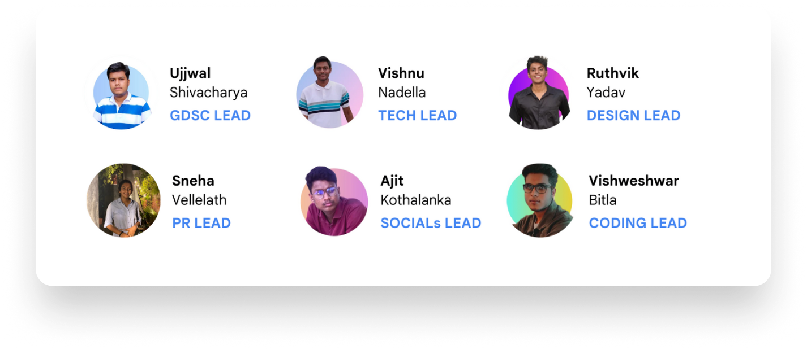
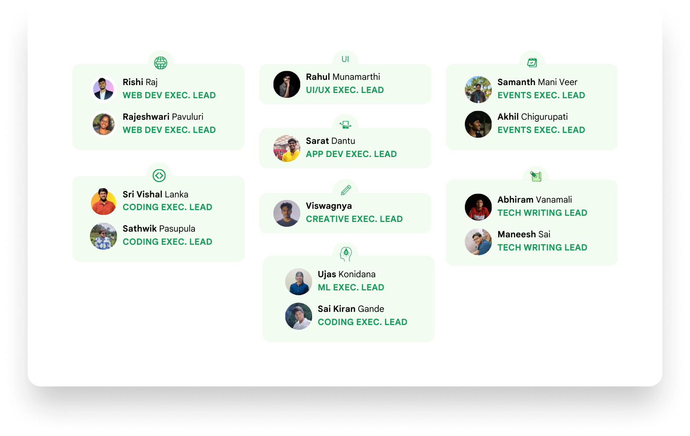

import Image from 'next/image'

# About Us

**GDSC IARE** is an institution-exclusive chapter of Google Developer Student Clubs driven by passionate students from **IARE, Hyderabad**. 

We are a group of students passionate about Technology. Our objective is to bring together students from various fields of interest who love learning and applying their skills to solve real-world problems.

## Meet the Team

**GDSC IARE** was first started in 2022 by [Ujjwal Shivacharya](https://ujjwalshiva.github.io), a passionate student pursuing BTech in CSE at IARE Hyderabad who got selected as the GDSC Lead for IARE Hyderabad for the year 2022-23. Since then, the community has seen exponential growth both in terms of strength and quality campaigns. During the 2022-23 term, the team structure looked as follows:

## Core Team 2022-23

## Executive Team 2022-23

