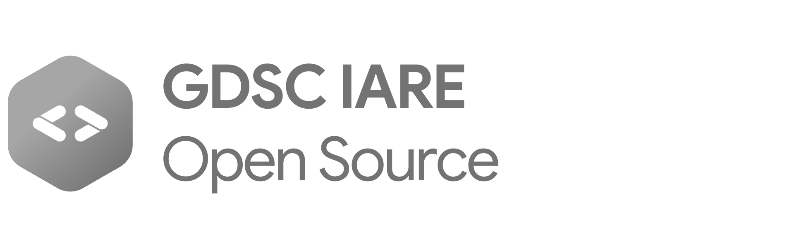
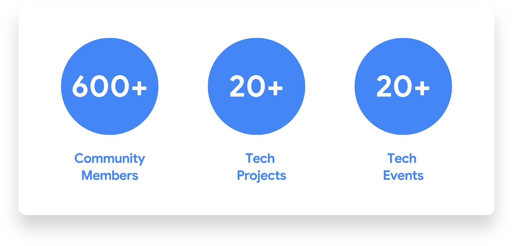

import { Card, Cards } from 'nextra-theme-docs'

# Introduction

 
Welcome to GDSC IARE Community. We're building this Open Source Platform as a one-stop centre to know everything about GDSC IARE. You can find pretty much everything that we have been doing since the past year (2022-23). 

Loved our content? Drop us your comments at [gdsc@iare.ac.in](mailto:gdsc@iare.ac.in)

## Overview

**GDSC IARE** is an institution-exclusive chapter of **Google Developer Student Clubs** driven by passionate students from our college.

Google Developer Student Clubs (GDSC) are university-based community groups powered by Google Developers for students interested in Technology. The aim is to help students bridge the gap between theory and practice. Students from all undergraduate or graduate programs with an interest in growing as a developer are welcome. By joining a GDSC, students grow their knowledge in a peer-to-peer learning environment and build solutions for local businesses and their communities.

## Our Status right now

## Quick Links

<Cards>
  <Card
    icon={
        
    }
    title="What We Do"
    href="/whatwedo"
  />

  <Card
    icon={
        
    }
    title="Our Initiatives"
    href="/ourinitiatives"
  />
  
</Cards>
<Cards>
  <Card
    icon={
        
    }
    title="Tech Projects"
    href="/tech_projects"
  />

  <Card
    icon={
        
    }
    title="Resources"
    href="/resources"
  />
  
</Cards>

